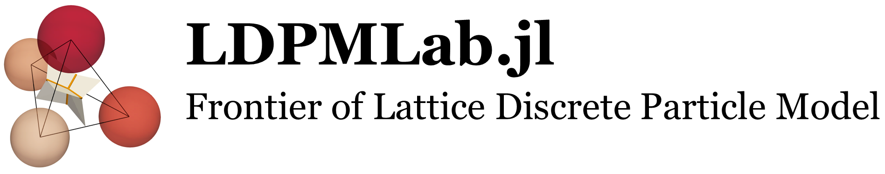

<p align="left">
    
</p>

- LDPMLab is an integral, open-source, high-performance Julia package for the state-of-the-art Lattice Discrete Particle Model (LDPM), first innovated by Prof. Cusatis of Northwestern in 2011. This package is developed under the supervision of Prof. Fascetti and Prof. Brigham at the University of Pittsburgh.

- This software tracks the cutting-edge advancements of LDPM, incorporating its variants in simulating mechanical and fracture behaviors of particle-reinforced materials with or without bar reinforcements, and mass transportation in heterogeneous materials. 

- The application can also be extended to homogeneous materials when particles are no longer realistically present, becoming a computationally more efficient substitute for FEM.

# Universal Applications
- Specially for:
    - Realistic meso-scale simulation of mechanical failure of particle-reinforced materials, such as concrete, shale, masonry, cementitious composites, granular rocks, polymers, etc.
    - Meso-scale mass transport simulation in damaged or non-damaged particle-reinforced materials
    - Interactive multiphysics simulation of particle-reinforced materials with reinforcing bars
    - Both static and dynamic loading conditions and transport boundaries are applicable
    - Advanced customizable nonlinear meso-scale constitutive laws for element-wise mechanical response and mass transportation
- More efficient substitute for FEM in simulating non-soft materials: 
    - Setting particle zero radius for homogeneous material simulation
    - Customizing local meshing for heterogeneous materials other than the particle-reinforced 

# Features
- Easy to use
- Both static and dynamic solution strategies are incorporated. Generally, the dynamic solution is recommended for its guaranteed convergence. The static solution is more accurate for quasi-static behaviors but may have difficulty in convergence for models with complicated constitutive laws or meshing
- Strict implementation of random particle distribution and distance check between adjacent particles
- Output files can be viewed in [Paraview](https://www.paraview.org/) and CSV readers

# Get started
## Installation
```
import Pkg
Pkg.add(url="git@github.com:DonggeJia/LDPMLab.git")
```

This will download the package and all the necessary dependencies for you. Next, you can import the package with

```
using LDPMLab
```
and you are ready to go.

## Workflow for Application
### 1. Specify Geometrical Parameters for an LDPM Model
- For particle-reinforced material:
    - Enter the values of material size in x, y, z dimensions (mm), cement content (kg/mm<sup>3</sup>), aggregate volume fraction (-), maximum particle size (mm), minimum particle size (mm), material parameter (-) for particle distribution where 0.5 corresponds to the classical Fuller curve, and scaling factor for minimum distance check in particle distribution where 1.0 means particle centroids must have a distance larger than 1.0*(radius of the first particle + radius of the second particle).
    ```
    LDPM.geometry_parameters = [200, 200, 70, 0.734, 15, 10, 0.45, 1.1]
    ```
- For particle-reinforced material with reinforcing bars:
    - Enter the values of the aforementioned geometrical parameters for particle-reinforced material, and then the height (in the z direction) of reinforcing bars (mm) and the diameter of reinforcing bars (mm).
    ```
    LDPM_bar_reforced.geometry_parameters = [200, 200, 70, 0.734, 15, 10, 0.45, 1.1, 20.0, 16.0]
    ```
    - Enter the transverse (in the y direction) distribution of reinforcing bars (mm).
    ```
    LDPM_bar_reforced.steel_layout = [50, 100, 150]
    ```
    By default, the orientation of reinforcing bars is along the x-coordinate.
### 2. Distribute Particles in the Material Volume
- For particle-reinforced material:
    ```
    Particle_distribution(LDPM, "Yes", "../output examples/LDPM_geometry")
    ```
    Where `Yes` means saving a JLD2 file with particle coordinates and their corresponding diameters. By default, `Yes` is used. Other strings except `Yes` mean not storing the current particle distribution. Saving particle distribution is encouraged so that it can be used again whenever the Julia session is restarted, excluding the influence of random particle distribution on solutions.

    `../output examples/LDPM_geometry` indicates the file folder and filename for particle distribution storage.
- For particle-reinforced material with reinforcing bars:
    ```
    particle_distribution(LDPM_bar_reforced, "Yes", "../output examples/LDPM_geometry")
    ```
The particle size distribution will be generated after running this function, for example,

<p align="center">
    
</p>

If particle distribution is stored, you can use

```
@load "../output examples/LDPM_geometry.jld2"
```
to reload all the procedures you've done in steps 1 and 2.
### 3. Meshing
This step implements the meshing process using Delaunay tetrahedralization and modified Voronoi tessellation.
A demonstration of the procedure from particle distribution to Delaunay tetrahedralization and Voronoi meshing is:
<p align="center">
    
</p>

- For particle-reinforced material:
    ```
    Meshing(LDPM, "Yes", "../output examples/LDPM_mesh_facets")
    ```
    Where `Yes` means saving a vtk file for Paraview to plot the contact facets in the material volume. 
    
    `../output examples/LDPM_mesh_facets` indicates the file folder and filename for storage.
- For particle-reinforced material with reinforcing bars:
    ```
    Meshing(LDPM_bar_reforced, "Yes", "../output examples/LDPM_mesh_facets")
    ```
The meshing plot for particle-reinforced materials with reinforcing bars is like:
<p align="center">
    
</p>

### 4. Set a Boundary Condition
    
Setting boundaries requires running a function:
`Boundary_setting(loaded_region, plot_boundary)`

`loaded_region` is a variable receiving the information of displacement-controlled boundaries. The expected input is a three-layer nested vector. The first layer is `[the first boundary, the second boundary, ..., the last boundary]`. Each boundary is a vector `[Boundary condition region, freedom degrees that boundary applied on boundary nodes, displacement velocities on these boundary freedom degrees]`. `Boundary condition region` is a $3 \times 2$ matrix where the first row indicates the boundary region in the x-coordinate that `Boundary condition region[1,1]` is the starting place (mm) and `Boundary condition region[1,2]` is the ending place (mm), the second row indicates the boundary region in the y-coordinate, and the third row indicates the boundary region in the z-coordinate. The unit of `displacement velocities on these boundary freedom degrees` is mm/second.

For example,
```
Boundary_setting([[[0 10; 0 200; 0 10], [1, 2, 3, 4, 5, 6], [0, 0, 0, 0, 0, 0]], [[190 200; 0 200; 0 10], [1, 2, 3], [0, 0, 0]], [[95 105; 0 200; 60 70], [3], [-0.2]]], "Yes")
```
`Yes` means the boundary will be plotted, other values for this parameter mean no plot. The plot is like:
<p align="center">
    
</p>

The boundary conditions are marked on each point with a format `local_freedom_degree_velocity`. Each point will have at most 6 marks for freedom degrees in x-direction movement, y-direction movement, z-direction movement, rotation about the x-axis, rotation about the y-axis, and rotation about the z-axis.

### 5. Specify Mechanical Parameters for an LDPM Model
- For particle-reinforced material:
    - Enter the values of initial elastic modulus for the matrix that wraps around the particles (MPa), initial elastic modulus for particles (MPa), tension stress limit (MPa), compression stress limit (MPa), shear stress limit (MPa), Mode I fracture energy (N/mm), Mode II fracture energy (N/mm), tangential-to-normal stiffness ratio (controls Poisson's effect) (-), exponent that controls the transition of the softening parameter (-), exponent that controls the transition of the hardening parameter (-), material's mass density (ton/mm<sup>3</sup>), first volumetric compression parameter (-), second volumetric compression parameter (-), parameter that governs the post-peak behavior in compression (-), and damping coefficient in dynamic solution (-).
    ```
    LDPM.mechanical_parameters = [45000.0, 45000.0, 3.0, -50.0, 10.0, 0.07, 0.35, 0.25, 2.0, 0.8, 2.5e-6, 1.0, 5.0, 11250.0, 0.0]
    ```
- For particle-reinforced material with reinforcing bars:
    - Enter the values of the just mentioned mechanical parameters for particle-reinforced material, and then the parameters for the reinforcing bar's constitutive law: initial elastic modulus (MPa), yield plateau strength (MPa), hardening strain (-), and the slope of hardening (MPa) in sequence.
    ```
    LDPM_bar_reforced.mechanical_parameters = [45000.0, 45000.0, 3.0, -50.0, 10.0, 0.07, 0.35, 0.25, 2.0, 0.8, 2.5e-6, 1.0, 5.0, 11250.0, 0.0, 1.96 * 10^5, 500, 0.02, 833.33]
    ```
    Here the trilinear simplified constitutive model for steel materials is adopted.

### 6. Solution
Solving the model is realized by
```
Solutions(LDPM, 0.2, 0.8)
```
for particle-reinforced materials and
```
Solutions(LDPM_bar_reforced, 0.2, 0.8)
```
for particle-reinforced materials with reinforcing bars.

`0.2` here gives the value of the scaling factor for time step. The time step is automatically determined by computing the natural frequencies of LDPM cells. `0.2` means one fifth of the calculated time step is used for better stability (-).

`0.8` indicates the value of `total time` the model will run (second). 

After this step, you already get the solution. A further step helps to output results and plot beautiful cracking patterns.
### 7. Post-process
    
Post-process uses a function like 
```
post_process(model_name, relative_time_of_cracking_=[0.4, 0.8, 1.0], crack_plot_dirc_and_name_="../output examples/cracking pattern", output_displacement_directions_=[[[90 110; 0 200; 0 10], [3]]], output_load_directions_=[[[90 110; 0 200; 60 70], [3]]], step_interval_=300, load_dis_out_name_="../output examples/200_200_70_deck", plot_dis_load_region_="Yes")
```
`model_name` should be `LDPM` for particle-reinforced materials and `LDPM_bar_reforced` for particle-reinforced materials with reinforcing bars.

This function enables you to output cracking data as vtk files at different time steps during the solution by `relative_time_of_cracking_`. By default, the cracking pattern plots will be generated at the time steps around `0.4` $\times$ `total time`, `0.8` $\times$ `total time`, and `1.0` $\times$ `total time`. 

`crack_plot_dirc_and_name_` indicates the file folder and filename for the cracking plot storage.

`output_displacement_directions_` is a three-layer nested vector. The first layer is `[the first region for displacement output, the second region for displacement output, ..., the last region for displacement output]`. Each region is a vector `[regional range, freedom degrees that output]`. `regional range` is a $3 \times 2$ matrix where the first row indicates the range of the region in x-coordinate that `regional range[1,1]` is the starting place (mm) and `regional range[1,2]` is the ending place (mm), the second row indicates the range of the region in y-coordinate, and the third row indicates the range of the region in z-coordinate. 

`output_load_directions_` has the same data structure as `output_displacement_directions_`, but the output is residual load values.
If `plot_dis_load_region` is given a `Yes`, the regions for displacement and load output will be plotted like:
<p align="center">
    
</p>

The points that outputted data comes from have a 6-number string representing 6 degrees of freedom in sequence. `1` means the displacement data is extracted, `2` means the residual load data is extracted, and `3` means both displacement and residual load data are drawn.

`step_interval_` claims the value of step interval that the output data will be thinned out so that the displacement and residual load will be extracted every `step_interval_` time step. 
Notice that for the stability of the dynamic solution, the first 500 time steps in the package are shrunk, while the following time steps use the same step length.

`load_dis_out_name_` indicates the file folder and filename for the displacement and load data storage.

The cracking pattern for particle-reinforced materials in Paraview is like:
<p align="center">
    
</p>

<p align="center">
    
</p>

The splitting failure of concrete after the steel is pulled out is like:
<p align="center">
    
</p>

Notice that Paraview has rich functionality in beautifying plots.

## Citation

If you find our work useful, please consider citing: 
```
@article{jia2024efficient,
  title={An efficient static solver for the lattice discrete particle model},
  author={Jia, Dongge and Brigham, John C and Fascetti, Alessandro},
  journal={Computer-Aided Civil and Infrastructure Engineering},
  year={2024},
  publisher={Wiley Online Library}
}
```
